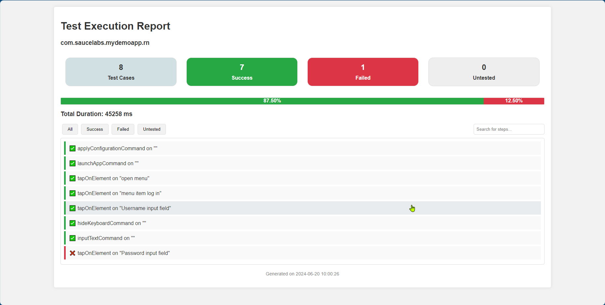

# Custom Reporting for Mobile Testing with Maestro Dev and Python

This repository provides a custom reporting solution for mobile testing using Maestro Dev and Python.

## Introduction

Maestro Dev is a mobile testing platform for automating tests across various devices and platforms. This repository demonstrates how to generate custom reports for your mobile testing results using Python.

## Features

- **Integration with Maestro Dev**: Automate mobile testing and capture test results.
- **Custom Reporting**: Generate customized reports to analyze test outcomes and trends.
- **Python Scripting**: Utilize Python to process and visualize test data effectively.

## Usage

1. **Run the Python Script**:
   ```bash
   python report_generator.py

